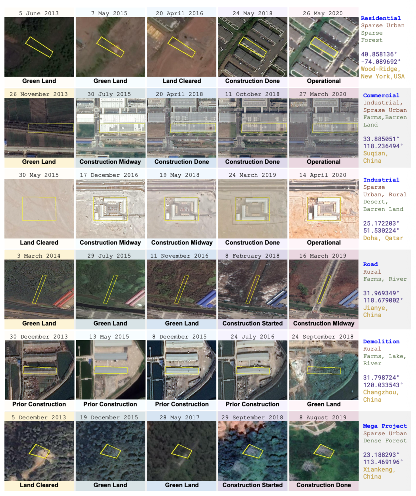

# Remote Sensing Change Classification (Kaggle 2EL1730 - 2026)

## Project overview
The goal is to classify geographical polygons through machine learning techniques into 6 categories from remote-sensing–derived features (GeoJSON dataset).

## Data
The dataset is provided in **GeoJSON** format and is split into two files: `train.geojson` (training set) and `test.geojson` (test set). 

Each sample corresponds to an **irregular polygon** (the `geometry` footprint) described by multi-date remote-sensing–derived attributes and neighborhood context. In particular, the data include **five observation dates** (`date1` to `date5`) and, for each date, a **categorical construction status** (`change_status_date1` to `change_status_date5`). 

For every date, the dataset also provides **image statistics** computed from a high-resolution RGB satellite image: the mean and standard deviation of the red, green, and blue channels (e.g., `img_red_mean_dateX`, `img_red_std_dateX`, etc.). 

Competition link to find the Data: <https://www.kaggle.com/competitions/2-el-1730-machine-learning-project-2026/overview>

## Approach
We follow a standard supervised-learning pipeline with feature engineering and model training. We first extract geometric features from each polygon and then build temporal features. We also summarize the multi-date RGB statistics with simple aggregates and differences. The contextual fields `urban_type` and `geography_type` are encoded using multi-hot, and we apply basic cleaning. Finally, we train and compare several classifiers, with LightGBM and XGBoost as our main models and Random Forest, k-NN, linear SVM, and an MLP as baselines. 

For more details on the methodology and results, please refer to our report: **[`report.pdf`](reports/report.pdf)**.

## Results
- LightGBM achieved the best validation Weighted-F1 in our local tests (≈ 0.779 on 3-fold stratified CV for the best configuration).

> Note: Kaggle public leaderboard uses a subset of the test set; final ranking may differ.
